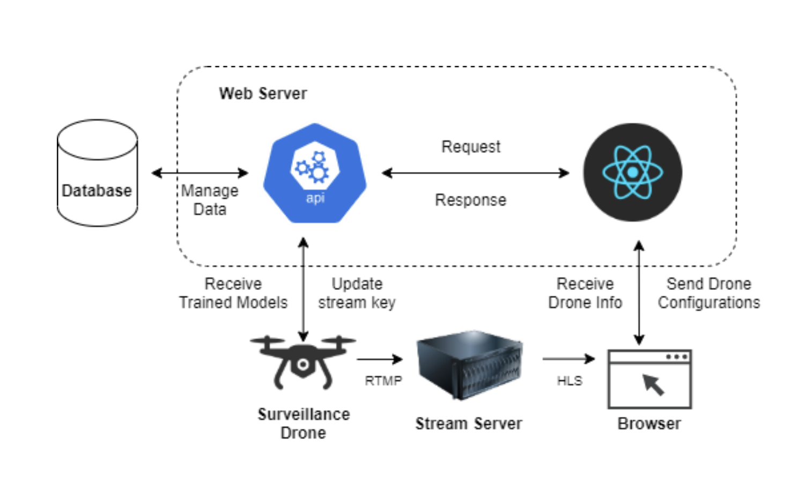

# Project Overview 
An implementation of a lightweight sureveilance system with real-time object detection capabilities. Developed and Tested on NVIDIA Jetson Nano hardware.

# Technologies Used
1. Python
2. Java 8 / Spring Boot
3. MongoDB
4. OpenCV
5. Ubuntu 18.04
6. Darknet/Yolov4
7. Google Cloud Platform

# System Design

1. A surveillance drone (powered by Jeston Nano hardware) perform object detection and send live feed using RTMP protocol.
2. The drone updates its stream key to the backend server and receive trained models for object detection using REST API
3. A dedicated RTMP server receives the live feed from the surveilance drone.
4. User interacts with a web application, which receive the drone's info and stream key to display the live feed using HLS Protocol.

# Contribution
In collaboration with J. Mukasa, K. Ruspic, J. Venema and A. Aboubkerx